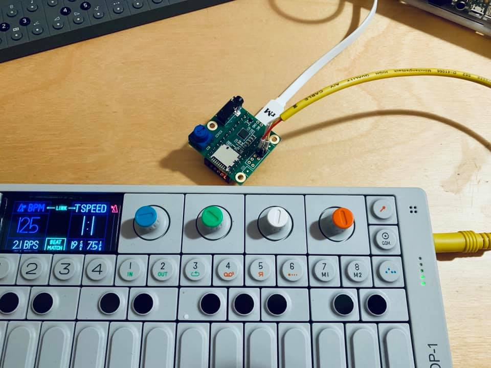

# OP-Go

A portable audio interface based on [Teensyboard](https://www.pjrc.com/store/teensy3_audio.html) to record Teenage Engineering gears on the go (+ maybe some Raspberry-Pi addon later to save patches etc.)

Arduino code is in SoundCard folder of corse ;)