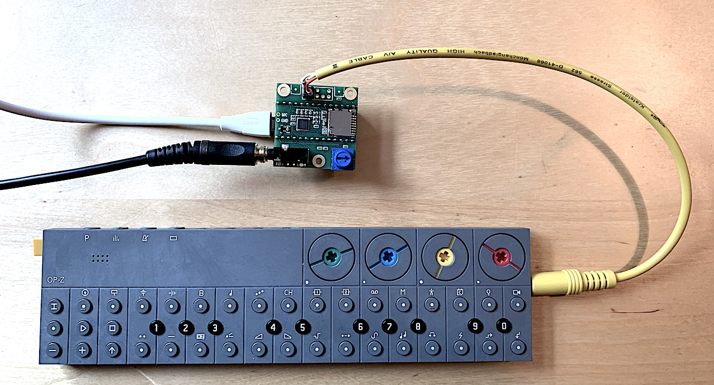
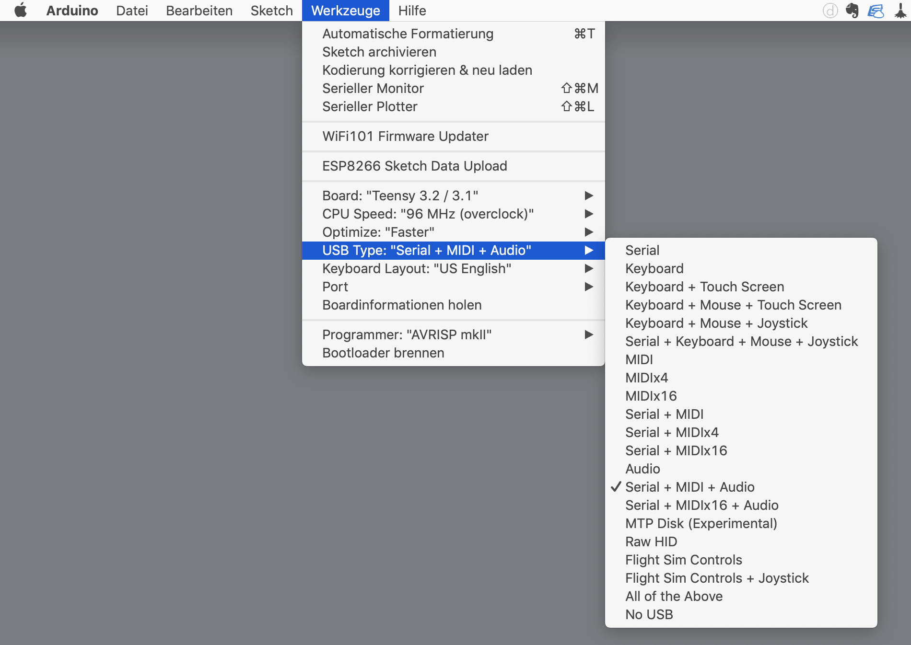

# SoundCard
This is the Arduino code for the portable audio interface project based on [Teensyboard](https://www.pjrc.com/store/teensy3_audio.html) to record Teenage Engineering gears on the go.

Currently it's just a small USB audioInterface with active monitoring and volume control on the audio-board's stereojack. 

#### Running the Code
Extensive info on using Teensy with [Arduino](https://www.arduino.cc) can be found on [Paul Stoffregen's Website](https://www.pjrc.com/teensy/td_libs_Audio.html). **Please note that you need to select "Audio+Serial+Midi" in the Arduino Editor** before uploading to the Teensy, otherwise the Audio Libs won't be available.

🖖🔊👯‍♀️